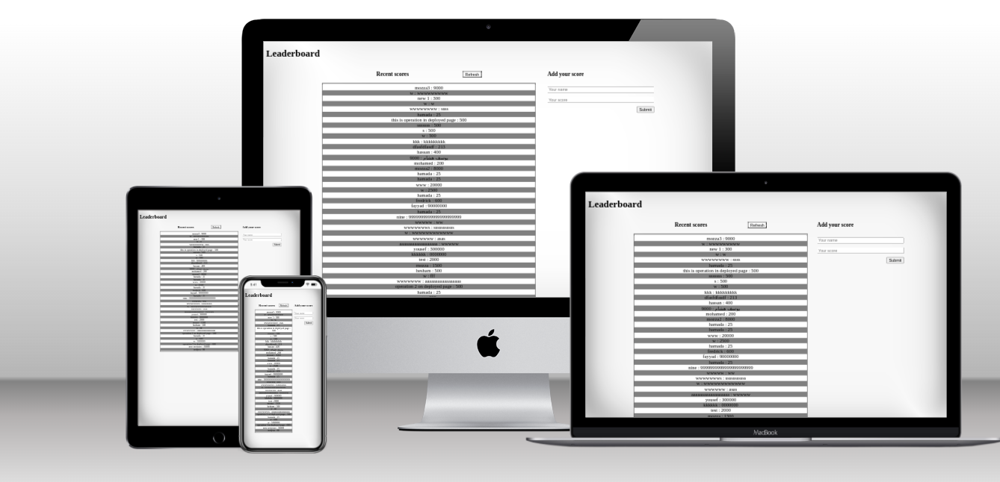

<a name="readme-top"></a>

# 📗 Table of Contents

- [📖 About the Project](#about-project)
  - [🛠 Built With](#built-with)
    - [Tech Stack](#tech-stack)
    - [Key Features](#key-features)
  - [🚀 Live Demo](#live-demo)
- [💻 Getting Started](#getting-started)
  - [Setup](#setup)
  - [Prerequisites](#prerequisites)
  - [Install](#install)
  - [Usage](#usage)
  - [Run tests](#run-tests)
  - [Deployment](#triangular_flag_on_post-deployment)
- [👥 Authors](#authors)
- [🔭 Future Features](#future-features)
- [🤝 Contributing](#contributing)
- [⭐️ Show your support](#support)
- [🙏 Acknowledgements](#acknowledgements)
- [📝 License](#license)


# 📖 [Leaderboard] <a name="about-project"></a>

**[Leaderboard]** is a A leaderboard created using Leaderboard API service, webpack, and gitflow. The user can add a new score and refresh to see his ranking in the leaderboard.



## 🛠 Built With <a name="built-with"></a>

### Tech Stack <a name="tech-stack"></a>

<details>
  <summary>Client</summary>
  <ul>
    <li><a href="https://www.javascript.com/">Javascript</a></li>
    <li><a href="https://html.com/">HTML5</a></li>
    <li><a href="https://developer.mozilla.org/en-US/docs/Web/CSS">CSS3</a></li>
    <li><a href="https://www.notion.so/microverse/Leaderboard-API-service-24c0c3c116974ac49488d4eb0267ade3">Leaderboard API Service</a></li>
     <li><a href="https://webpack.js.org/">Webpack</a></li>
  </ul>
</details>

### Key Features <a name="key-features"></a>

- **[Show top ranked users]**
- **[Add Users]**
- **[Refresh the board]**

<p align="right">(<a href="#readme-top">back to top</a>)</p>


## 🚀 Live Demo <a name="live-demo"></a>


You can check a **Live Demo** [here.](https://yosefhesham.github.io/leaderboard/dist/)

<p align="right">(<a href="#readme-top">back to top</a>)</p>


## 💻 Getting Started <a name="getting-started"></a>


To get a local copy up and running, follow these steps.

### Prerequisites

- A web browser (like Google Chrome, Opera...).
- A code editor (like Atom, VScode...).

### Setup

To setup the project locally: clone the repository using:

```
git clone https://github.com/yosefHesham/leaderboard
```

### Install dependencies

run : `npm install`

### Build the app

run: `npm run build`

### Run the app

run: `npm start`

### Deployment

Use github pages or just run index.html to test it locally.


<p align="right">(<a href="#readme-top">back to top</a>)</p>

## 👥 Authors <a name="authors"></a>

👤 **Yosef Hesham**

- GitHub: [@yosefHesham](https://github.com/yosefHesham)
- LinkedIn: [Yousef Hesham](https://www.linkedin.com/in/yousef-hesham98/)
- Twitter: [@yosef](https://twitter.com/Yousef45653478)

<p align="right">(<a href="#readme-top">back to top</a>)</p>

## 🔭 Future Features <a name="future-features"></a>


- [ ] **[Delete a user]**
- [ ] **[Reset a score]**

<p align="right">(<a href="#readme-top">back to top</a>)</p>

## 🤝 Contributing <a name="contributing"></a>

Contributions, issues, and feature requests are welcome!

Feel free to check the [issues page](../../issues/).

<p align="right">(<a href="#readme-top">back to top</a>)</p>

## ⭐️ Show your support <a name="support"></a>

Give a star if you like this project!

<p align="right">(<a href="#readme-top">back to top</a>)</p>

## 🙏 Acknowledgments <a name="acknowledgements"></a>

- Hat tip to Microverse's code reviewers and to everyone who reviewed my project and made suggestions.


<p align="right">(<a href="#readme-top">back to top</a>)</p>

## 📝 License <a name="license"></a>

This project is [MIT](./LICENSE) licensed.

<p align="right">(<a href="#readme-top">back to top</a>)</p>

